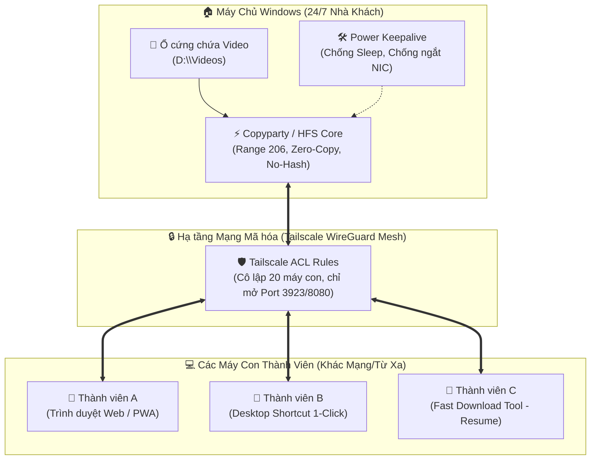

# 🚀 Download-Video-Team

> **Giải pháp trọn gói biến một máy tính PC Windows nhàn rỗi thành Kho Video Server 24/7 tốc độ cao, hỗ trợ xem trước (preview), tải tiếp khi đứt mạng (resume) cho đội ngũ ~20 người truy cập từ xa an toàn tuyệt đối.**

---

## 📌 Kiến trúc Tổng thể Hệ thống



---

## 📁 Cấu trúc Thư mục Dự án

```text
Download-Video-Team/
├── client/                              # Bộ công cụ cho Máy Con (Thành viên)
│   ├── 1_click_join.bat                 # Script tự động kết nối Tailscale & tạo Shortcut Desktop
│   └── fast_download.bat                # Công cụ tải file lớn (10GB - 50GB) hỗ trợ Resume
│
├── server/                              # Bộ công cụ cho Máy Chủ (Windows PC 24/7)
│   ├── config/
│   │   ├── copyparty.conf               # Cấu hình Copyparty tối ưu tốc độ, chống nghẽn đĩa
│   │   ├── hfs.yaml                     # Cấu hình dự phòng HFS v3
│   │   └── tailscale_acl.json           # File phân quyền ACL cô lập các máy con
│   └── scripts/
│       ├── setup_server.bat             # Cài đặt tự động môi trường và Startup cho server
│       ├── start_server_manual.bat      # Khởi động server trực tiếp ở chế độ màn hình đen
│       └── win_power_keepalive.ps1      # Tinh chỉnh Windows chống Sleep, chống tắt card mạng
│
├── docs/                                # Bộ hồ sơ bàn giao & Hướng dẫn sử dụng
│   ├── 01_TRIEN_KHAI_MAY_CHU.md         # Hướng dẫn chi tiết setup PC Server 24/7 từ A-Z
│   ├── 02_HUONG_DAN_MAY_CON.md          # Hướng dẫn 1 trang cho thành viên (3 bước dễ hiểu)
│   ├── 03_CAU_HINH_BAO_MAT_TAILSCALE.md # Hướng dẫn cấu hình ACL và tạo Reusable Auth Key
│   └── 04_KICH_BAN_CHOT_GIA_VA_BAN_GIAO.md # Kịch bản báo giá (5tr - 8tr) và biên bản nghiệm thu
│
├── references/                          # Mã nguồn clone phục vụ phân tích (copyparty, hfs)
└── README.md                            # Tài liệu tổng quan dự án
```

---

## ⚡ Bắt đầu Nhanh (Quick Start)

> **Lưu ý quy trình làm việc**:
> - Máy tính lập trình/chuẩn bị mã nguồn hiện tại là: **macOS**.
> - Máy chủ đích triển khai là: **Windows PC**.
> - Máy con của người dùng là: **Windows / macOS / Trình duyệt Web**.

### 1. Đẩy code lên GitHub từ máy macOS
```bash
git add .
git commit -m "feat: complete turnkey video server package with configs, scripts and docs"
git push origin main
```

### 2. Khi sang Máy Chủ Windows của khách
1. Clone hoặc tải ZIP thư mục này về máy chủ:
   ```cmd
   git clone https://github.com/huypv2002/Download-Video-Team.git
   ```
2. Mở file [docs/01_TRIEN_KHAI_MAY_CHU.md](file:///Users/phamvanhuy/Downloads/Download-Video-Team/Download-Video-Team/docs/01_TRIEN_KHAI_MAY_CHU.md) và làm theo 6 bước hướng dẫn.
3. Chỉ mất khoảng **10 - 15 phút** là server video đi vào hoạt động ổn định 24/7.

### 3. Khi bàn giao cho Thành viên máy con
1. Gửi file [docs/02_HUONG_DAN_MAY_CON.md](file:///Users/phamvanhuy/Downloads/Download-Video-Team/Download-Video-Team/docs/02_HUONG_DAN_MAY_CON.md) kèm file [client/1_click_join.bat](file:///Users/phamvanhuy/Downloads/Download-Video-Team/Download-Video-Team/client/1_click_join.bat) cho các thành viên trong nhóm.
2. Thành viên bấm chạy file là có ngay biểu tượng **Kho Video Team** trên Desktop để mở xem và tải video.

---

## 🛡️ Ưu điểm Kỹ thuật Vượt trội
1. **Range Request 206**: Xem trước video trực tiếp trên trình duyệt, tua nhanh không load lại toàn bộ file.
2. **Cờ `no-hash` & `turbo`**: Khắc phục triệt để tình trạng 100% Full Disk (HDD thrashing) khi quét thư mục chứa hàng trăm GB video.
3. **Bảo mật Zero-Trust Tailscale ACL**: 20 máy con hoàn toàn bị cô lập, không thể soi mạng nội bộ của nhau, chỉ truy cập được đúng cổng Web Video của máy chủ.
4. **Windows Keepalive 24/7**: Tự động vô hiệu hóa chế độ Sleep, tắt ngắt điện card mạng, hoãn Windows Update tự động restart.
